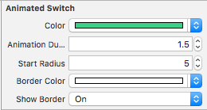

# AnimatedSwitch
[](https://developer.apple.com/swift/)
[]()
[](http://twitter.com/alsedi)
[](http://blog.alsedi.com)

Swift subclass of the UISwitch which paints over the parent view with the `color` if switch is turned on and returns original superview background color if switch is off. 

Inspired by concept from [this Dribbble](https://dribbble.com/shots/1749645-Contact-Sync)


# Screenshot


## Requirements
- Swift 3.1
- iOS 9.3+
- Xcode 7.3+

# Installation
Copy `AnimatedSwitch.swift`to your project. Copy file if needed.

# Usage
AnimatedSwitch adds nice material-design-like animation to your UISwitch. 

AnimatedSwitch uses custom color for state `on` and superview background color for state `off`

When activated fills super view area with circle shape of specific color

## How to create
### Programatically 
``` swift
let switch = AnimatedSwitch()
```

### Storyboard and XIB
1. Drap and drop a new UISwitch
2. Set the class of the UISwitch to AnimatedSwitch
3. Set `color` for the switch
4. Set other parameters



## Configurable properties (in code and in Interface Builder)
```
All regular UISwitch
```
1. `color` animation color for `on` state (`off` state uses `superview.backgroundColor`). Default `.clearColor()`
2. `animationDuraton` how long AnimatedSwitch will draw circle to fill the superview frame. Default `0.25`
3. `startRadius` circle radius that will be shown on screen without animation. Default `15` (to fit UISwitch size)
4. `borderColor` border color for `on` state. Default `.colorWhite`
5. `showBorder` should border appear around UISwitch for `on` state. Default `true`
6. `shape` filling shape: `.Round`, `.Star`, `.Dimond` or `.Cusom(UIBezierPath)`. Default `.Round` (NB! Can be set in code only)

## Callbacks
Animation started
``` swift
let switch = AnimatedSwitch()
switch.animationDidStart = {
  // do something
}
```

Animation Finished
``` swift
switch.animationDidStop = {  
  // do something
}
```

## About
I made this switch to practice my skills in animation.

The implementation inspired by Marin Todorov book [iOS Animations by Tutorials](https://www.raywenderlich.com/store/ios-animations-by-tutorials) and [Ramotion Inc. animation on Dribble](https://dribbble.com/shots/1749645-Contact-Sync). Please note that this [Ramotion Inc. provided their own implementation](https://github.com/Ramotion/paper-switch/), but it uses another approach for animation.

	
